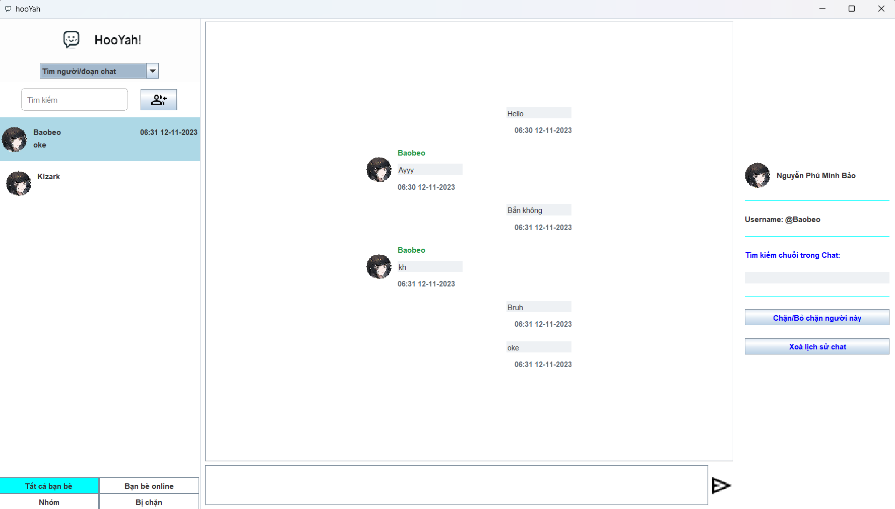
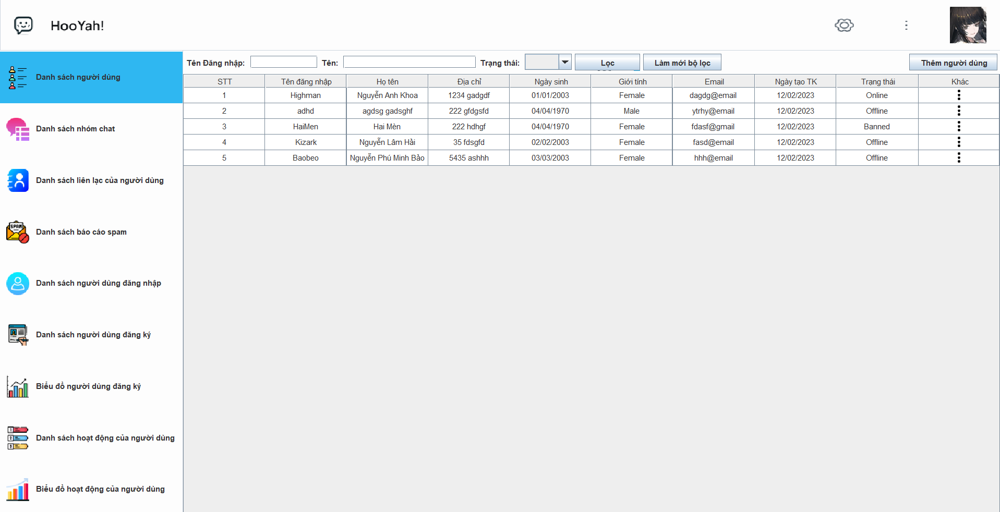

# Java-hooYah

## 1. Giới thiệu
Một ứng dụng cho phép người dùng gửi tin nhắn qua lại với nhau, hoặc tạo nhóm chat để gửi tin nhắn. Đồng thời, quản trị viên có thể quản lý, theo dõi và ghi nhận những hoạt động do người dùng thực hiện trong quá trình sử dụng ứng dụng.

## 2. Thành viên
- 21127517 - Nguyễn Anh Khoa - Vai trò: Trưởng nhóm, lập trình viên Back-end
- 21127604 - Nguyễn Lâm Hải - Vai trò: Lập trình viên Front-end
- 21127013 - Nguyễn Phú Minh Bảo - Vai trò: Lập trình viên Back-end

## 3. Tech Stack
### Backend:
- Java SE (Standard Edition): The core Java platform used for developing desktop applications.
- Database: MySQL.
### Frontend:
- Swing: được sử dụng để tạo giao diện người dùng đồ họa (GUI) của ứng dụng desktop. Chúng xử lý việc hiển thị cửa sổ, nút, menu và các phần tử giao diện người dùng khác.
### Các công cụ khác:
- Version control - Github: để quản lý các thay đổi trong code.

## 4. Screenshots

